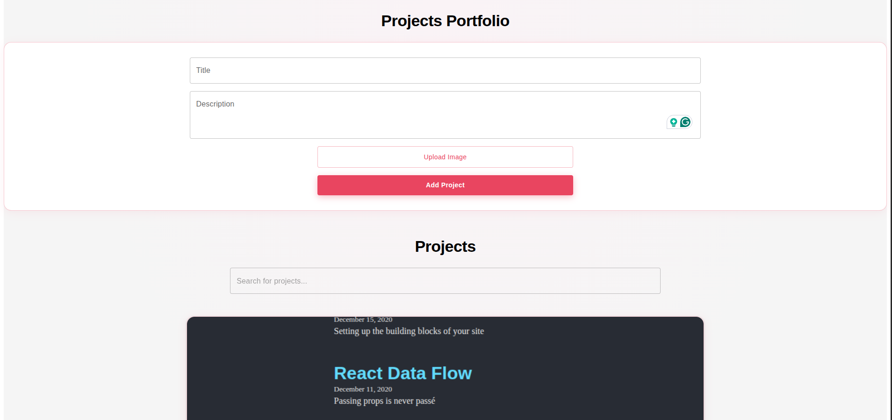

# Portfolio Project

A React application for managing and showcasing your personal projects. Add, search, and delete projects with image support and persistent storage.

---

## Features

- Add projects with a title, description, and image
- Search projects by title in real time
- Delete projects
- Data persists in the browser using localStorage
- Responsive and clean UI built with Material UI

---

## Components

| Component | Description |
|---|---|
| `App.jsx` | Root component, holds all state and logic |
| `ProjectForm.jsx` | Form to add a new project |
| `SearchBar.jsx` | Input to filter projects by title |
| `ProjectList.jsx` | Renders the list of project cards |
| `ProjectCard.jsx` | Displays a single project with image, title, description, and delete button |

---

## Getting Started

### Prerequisites
- Node.js installed
- npm 

### Installation

```bash
# Clone the repository
git clone https://github.com/your-username/portfolio-project.git

# Navigate into the project folder
cd portfolio-project

# Install dependencies
npm install

# Start the development server
npm run dev
```

---

## Tech Stack

- [React](https://react.dev/) — UI library
- [Material UI](https://mui.com/) — Component and styling library
- localStorage — Client-side data persistence

---

## React Concepts Used

- `useState` — managing form inputs, project list, error, and search state
- `useEffect` — loading and saving projects to localStorage
- Component composition — breaking UI into reusable components
- Props — passing data and handlers between components
- Controlled components — form inputs controlled by React state
- Conditional rendering — showing empty states and error messages
- List rendering — mapping projects to cards with unique keys

---

## Author

Made by Philip Muchiru

